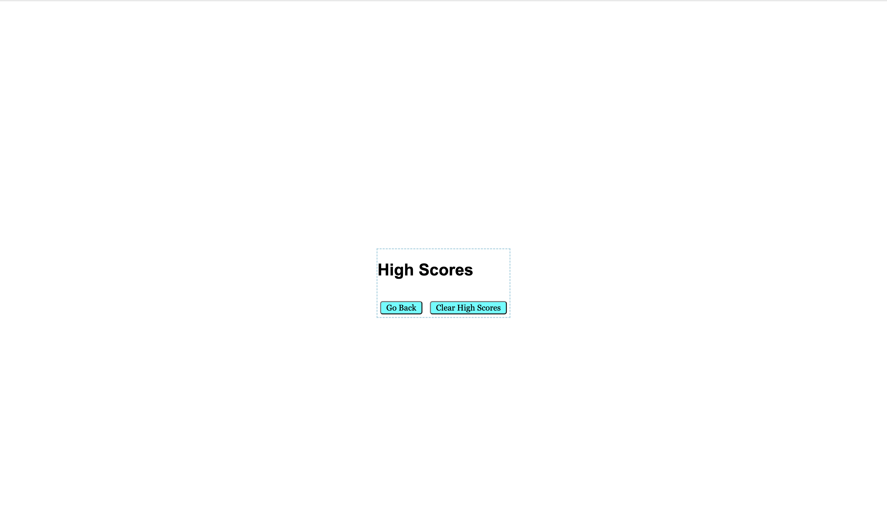

# coding-quiz

Week 4 coding quiz

# <Coding Quiz>

## Description

Provide a short description explaining the what, why, and how of your project. Use the following questions as a guide:
The purpose of this assignment was to be able to traverse down the DOM and pull objects from the DOM and display them on the page. This also shows the ability to save items to local storage and also pull them from local storage and display it on the page. This page is to help you study your javascript skills as well. In this project I learned how to create elements and buttons with javascript as well as make a dynamic application with just javascript, css and html.

## Table of Contents (Optional)

Not Applicable

## Installation

N/A the application can be ran in the browser.

https://dakota32jones.github.io/coding-quiz/

## Usage

To start the quiz, hit the start Quiz button. You will then have 75 seconds to answer each questions. If you miss a question the timer in the right hand corner will decrease by 15 seconds. Once time has ran out, or if you have answered all questions, you will be prompted with putting in your intiials and saving your high score.

To add a screenshot, create an `assets/images` folder in your repository and upload your screenshot to it. Then, using the relative filepath, add it to your README using the following syntax:

    

    

    

## Credits

Not applicable

## License

MIT License

Copyright (c) [2022] [Dakota Jones]

Permission is hereby granted, free of charge, to any person obtaining a copy
of this software and associated documentation files (the "Software"), to deal
in the Software without restriction, including without limitation the rights
to use, copy, modify, merge, publish, distribute, sublicense, and/or sell
copies of the Software, and to permit persons to whom the Software is
furnished to do so, subject to the following conditions:

The above copyright notice and this permission notice shall be included in all
copies or substantial portions of the Software.

THE SOFTWARE IS PROVIDED "AS IS", WITHOUT WARRANTY OF ANY KIND, EXPRESS OR
IMPLIED, INCLUDING BUT NOT LIMITED TO THE WARRANTIES OF MERCHANTABILITY,
FITNESS FOR A PARTICULAR PURPOSE AND NONINFRINGEMENT. IN NO EVENT SHALL THE
AUTHORS OR COPYRIGHT HOLDERS BE LIABLE FOR ANY CLAIM, DAMAGES OR OTHER
LIABILITY, WHETHER IN AN ACTION OF CONTRACT, TORT OR OTHERWISE, ARISING FROM,
OUT OF OR IN CONNECTION WITH THE SOFTWARE OR THE USE OR OTHER DEALINGS IN THE
SOFTWARE.

---

🏆 The previous sections are the bare minimum, and your project will ultimately determine the content of this document. You might also want to consider adding the following sections.

## Badges

Not applicable

## Features

Some features are accessing the DOM through javascript.

Accessing local storage to save scores.

## How to Contribute

Not applicable

## Tests

Not applicable
